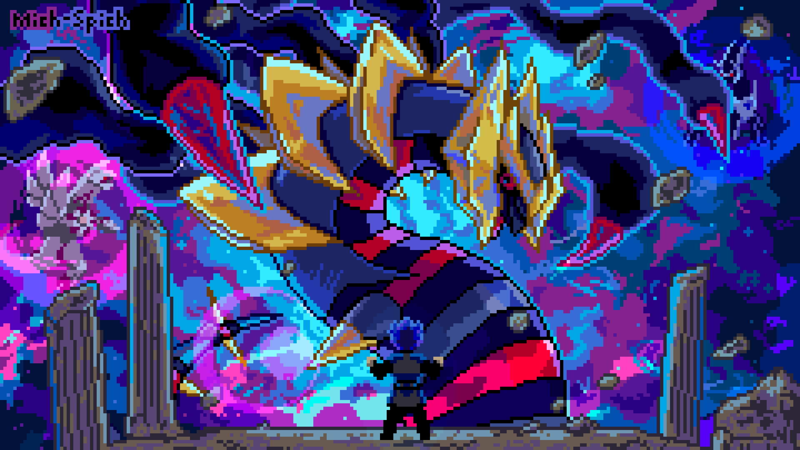

## 
  

## 
 🌊 ABOUT ME 🌊 

| | |
| - | - |
|📛 Full Name      | Hoang Nguyen Viet (Harry Cain)|
|🎂 Birthday       | 07/02/2005 |
|📍 Location       | Ha Noi Capital, Viet Nam|
|👜 Profession     | Self-taught Game Developer & Game Designer|
|🎓 University     | University of Transport and Communications|
|🎲 Hobbies        | Listening to music, Coding, Drawing, Playing games, ...   |
| | |

##

  

  Source: <a href="https://i.pinimg.com/originals/54/e1/d6/54e1d64489baf626c6f3c93de93b6913.gif">Original GIF</a>

  

##

# My Skills and Tools

### 🌐 Languages
 
 
 
 
 

### 🕸️ Web Development
 
 

### 🗃️ Backend & Databases

### 🖼️ Design & UI
 
 
 

### 🎲 Game Development
 
 
 

### 🕹️ Version Control
 
 

### 🤙 Productivity & Collaboration
 

### Gaming Platforms
 

##

### 🥰 You can reach me at

| Social Media | Link |
|--------------|------|
|  | [Facebook](https://www.facebook.com/huang.high.3/) |
|  | [GitHub](https://github.com/NguyenVietHoang725) |
|  | [LinkedIn](https://www.linkedin.com/in/hoangnguyenviet/) |
|  | [Gmail](mailto:hoangnguyen72.dev@gmail.com) |
|  | [Instagram](https://www.instagram.com/__ng.naoh/) |
|  | [TikTok](https://www.tiktok.com/@huanghigh) |
|   | [Itch.io](https://harrycain.itch.io) |

  Source: <a href="https://i.pinimg.com/originals/54/e1/d6/54e1d64489baf626c6f3c93de93b6913.gif">Original GIF</a>

##

## 
 🏆 GitHub Profile Trophies 🏆 

  

##
## 
 📊 Github Statistics 📊 

---

<picture>
  <source media="(prefers-color-scheme: dark)" srcset="https://raw.githubusercontent.com/NguyenVietHoang725/NguyenVietHoang725/output/pacman-contribution-graph-dark.svg">
  <source media="(prefers-color-scheme: light)" srcset="https://raw.githubusercontent.com/NguyenVietHoang725/NguyenVietHoang725/output/pacman-contribution-graph.svg">
  
</picture>

##

### ❤️ Support Me

<a href="https://www.buymeacoffee.com/https://buymeacoffee.com/harrycain">

<!-- Proudly created with GPRM ( https://gprm.itsvg.in ) -->

<!---
NguyenVietHoang725/NguyenVietHoang725 is a ✨ special ✨ repository because its `README.md` (this file) appears on your GitHub profile.
You can click the Preview link to take a look at your changes.
--->
